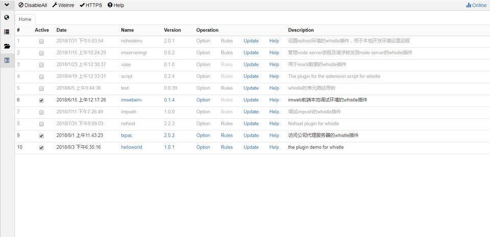
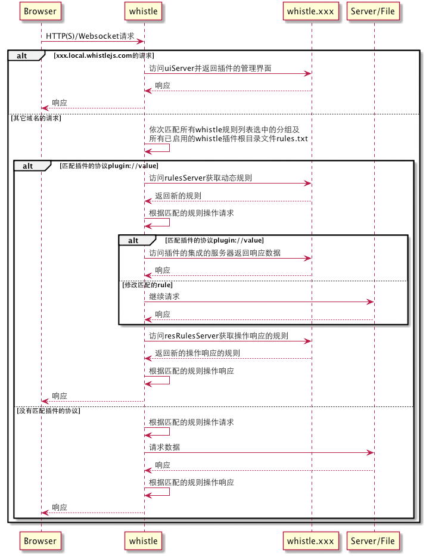

# 插件开发
为了满足一些特定业务场景自定义规则的需求，whistle提供了插件扩展能力，通过插件可以扩展whistle的协议实现更复杂的操作、上报监控指定请求、集成业务本地调试环境等等，基本上可以做任何你想做的事情，且开发、发布及安装whistle插件也都很简单。


先简单了解下如何安装使用插件：

#### 安装插件
whistle的插件就是一个Node模块，名字必须为 `whistle.your-plugin-name` 或 `@org/whistle.your-plugin-name`，其中 `your-plugin-name` 为插件名称，只能包含小写字母、数字、_、-四种字符，安装插件直接全局npm安装即可：

```
npm i -g whistle.your-plugin-name
# 或
npm i -g @org/whistle.your-plugin-name
```
> Mac或Linux安装时如果报权限错误，则需要加上 `sudo`，如：`sudo npm i -g whistle.your-plugin-name`
> 国内可以用[cnpm](https://github.com/cnpm/cnpm)或公司自己大家的镜像安装

全局安装后，可以在whistle的界面上看到所有已安装的插件列表(whistle定时搜索npm的全局目录，并自动加载或卸载插件，无需重启whistle)。



#### 使用插件
插件安装后，whistle会新增两个协议，分别为 `whistle.your-plugin-name` 和 `your-pluign-name`，用户通过配置：
```
pattern whistle.your-plugin-name://xxx
# 或
pattern your-plugin-name://xxx
```
配置后即可使用插件集成的功能，whistle会根据不同的配置把请求或响应的信息及配置的值(如：`xxx`)，转发到插件里面不同的服务，并根据某些服务响应设置新的规则，或直接把请求转个插件处理，插件如何实现这些配置的具体功能及其应用，我们先了解下如何创建及发布一个whistle插件的项目。

# 实现原理
whistle的插件是一个独立运行的进程，这样是为了确保插件不会影响到whistle主进程的稳定性，并通过暴露一些http server的方式实现与whistle的交互，whistle会在特定阶段请求特定的server，具体看下面的原理图：


> 图一：表示正常的http(s)、WebSocket请求可能触发的插件内置的server


> 图二：表示tunnel请求可能触发的插件内置的server，tunnel请求如上图指没有开启https捕获，或一般的TCP请求

从上面几个图可以知，whistle插件会设计以下几种server：

1. statsServer：统计请求信息的服务
2. resStatsServer：统计响应信息的服务
3. rulesServer：设置请求规则的服务(支持http/https/websocket请求)
4. resRulesServer：设置响应规则的服务(支持http/https/websocket请求)
5. tunnelRulesServer：设置tunnel请求规则的服务
6. server：whistle会把指定请求转发到该server

以上这些server都是可选的，根据需要实现对应的server即可，比如：

1. 统计请求信息，可以用 `statsServer` (统计响应信息可以用 `resStatsServer`)；
2. 设置请求规则可以用 `rulesServer` (如果是tunnel请求用 `tunnelRulesServer`，如果这两种请求的规则都一样，可以用 `pluginRulesServer`)；
3. 设置响应规则可以用 `resRulesServer`；
4. 如果想独占操作请求，可以用 `server`，whistle会把指定请求转发到该server

上面各个server的用法参考下面的例子：

# 快速上手


下面我们来实现如下功能的插件：

1. 根据请求url里面的形如 `req.headers.x-key1-name=value1&res.headrs.x-key2-name=value2&host=127.0.0.1` 参数设置请求及响应头、服务器IP
2. 把服务器IP设置到响应头字段 `x-server-ip`
3. 把抓包数据保存到通过UI配置的数据库
4. 支持mock数据

#### 创建项目
创建一个名为[whistle.hellworld](https://github.com/whistle-plugins/whistle.helloworld)的项目:

```txt
whistle.helloworld
  |__ package.json
  |__ index.js
  |__ lib
      |__ uiServer.js
      |__ data.js
      |__ rulesServer.js
      |__ server.js
      |__ resRulesServer.js
```
具体项目代码请访问Github：[https://github.com/whistle-plugins/whistle.helloworld](https://github.com/whistle-plugins/whistle.helloworld)。


#### 调试项目


#### 发布项目


#### 使用


如上说，whistle的项目欣慰

whistle的每个插件就是一个Node模块，名字必须为 `whistle.your-plugin-name` 或 `@org/whistle.your-plugin-name`，其中 `your-plugin-name` 为插件名称，且只能包含小写字母、数字、_、-四种字符。

每个插件运行在一个独立的进程里面，并暴露一些server让whistle调用，whistle会根据规则配置及插件实现的server自动把请求转发到对应的server，及根据响应设置新规则等，

#### 服务钩子

#### 一些应用

每个whistle插件就是一个名字为 `whistle.your-plugin-name` 或 `@org/whistle.your-plugin-name`的Node模块，其中 `your-plugin-name` 表示只能包含小写字母、数字、_、-四种字符的插件名称，whistle根据不同功能给插件提供了不同的可选钩子，每个钩子对应个http server，通过这些server可以动态设置规则、监控请求、获取当前抓包数据、甚至可以

有些功能用的比较少的功能，及一些跟业务相关的功能，如：

* 查看websocket的传输内容
* 查看如图片等富媒体资源
* 集成一些本地服务(处理[combo请求](https://github.com/whistle-plugins/whistle.tianma))
* 动态设置规则(通过远程服务器动态判断请求设置哪些规则)
* 加载本地指定的规则文件

等等，考虑到会导致安装过程比较长或者占用内存空间或者适应范围比较小，whistle没有把这些功能加进去，但提供了插件的方式扩展这些功能。

whistle插件本身就是一个普通的Node模块，只是名字要按照`whistle.xxx`的形式命名，其中`xxx`指插件的名称且只能包含小写字母、数字、_、-四种字符，如：[whistle.helloworld](https://github.com/whistle-plugins/whistle.helloworld)、[whistle.tianma](https://github.com/whistle-plugins/whistle.tianma)、[whistle.vase](https://github.com/whistle-plugins/whistle.vase)，而`xxx`就是扩展的协议，可以直接在Rules里面配置使用，我们先看下whistle的时序图及插件的结构，了解whistle如何加载执行插件，然后再讲下如何开发、发布、安装插件。

whistle的时序图：



### 编写插件

whistle插件目录结构：

```txt
whistle.xxx
  |__ package.json
  |__ rules.txt
  |__ _rules.txt
  |__ index.js
  |__ lib
      |__ uiServer.js
      |__ statusServer.js
      |__ rulesServer.js
      |__ server.js
      |__ resRulesServer.js
```

除了package.json，其它都是可选的，其中(参考时序图)：

* package.json
  ```js
  {
      "name": "whistle.xxx",
      "version": "0.0.1",
      "description": "xxxx",
      "homepage": "插件的帮助或官网链接",
      //others
  }
  ```
* rules.txt: 插件的全局规则，只要插件启用，所有请求都会查找匹配
* _rules.txt: 插件的私有规则，只有请求匹配插件的规则`xxx://value`，才会去查找匹配

* index.js
  ```js
  module.exports = require('./lib/server');
  module.exports.uiServer = require('./lib/uiServer');
  module.exports.rulesServer = require('./lib/rulesServer');
  module.exports.resRulesServer = require('./lib/resRulesServer');
  ```

* lib/uiServer: `xxx.local.whistlejs.com`域名下的请求都会直接访问该server，可用于后台管理界面

  ```js
  module.exports = function(server, options) {
  /*
  * options包含一些自定义的头部字段名称及配置信息，后面单独统一讲
  * server是whistle传给插件的http.Server对象，
  * 开发者通过监听server的相关事件处理ui相关的请求(http或websocket)
  */
  };
  ```

* lib/statusServer: 状态服务器，whistle会把请求的各种状态post过来，请求只要匹配了插件的协议规则`xxx://value或plugin://xxx(value)`(`xxx`为插件`whistle.xxx`的名称)

  ```js
  module.exports = function(server, options) {
    /*
    * options包含一些自定义的头部字段名称及配置信息，后面单独统一讲
    * server是whistle传给插件的http.Server对象，
    * 开发者通过监听server的request事件获取请求信息，
    * 并返回新的规则
    */
  };
  ```

* lib/rulesServer: 规则服务器，请求只要匹配了插件的协议规则`xxx://value或plugin://xxx(value)`(`xxx`为插件`whistle.xxx`的名称)，就会把一些请求带放在头部请求该server，该server可以根据需要返回新的规则
  ```js
  module.exports = function(server, options) {
    /*
    * options包含一些自定义的头部字段名称及配置信息，后面单独统一讲
    * server是whistle传给插件的http.Server对象，
    * 开发者通过监听server的request事件获取请求信息，
    * 并返回新的规则
    */
  };
  ```

* lib/server: 处理请求的server，可以做请求合并等，返回的数据就是请求的响应数据

  ```js
  module.exports = function(server, options) {
    /*
    * options包含一些自定义的头部字段名称及配置信息，后面单独统一讲
    * server是whistle传给插件的http.Server对象，
    * 开发者通过监听server的相关事件处理whistle转发过来的请求
    */
  };
  ```
* lib/resRulesServer: 响应规则服务器，在请求响应后到达浏览器前whistle会把一些请求信息传给该server，该server可以返回新的规则

  ```js
  module.exports = function(server, options) {
    /*
    * options包含一些自定义的头部字段名称及配置信息，后面单独统一讲
    * server是whistle传给插件的http.Server对象，
    * 开发者通过监听server的request事件获取响应信息，
    * 并返回新的处理响应的规则
    */
  };
  ```

* options
  ```js
  {
    name: // 插件的名称,
    RULE_VALUE_HEADER: // 存储配置的规则值的请求头字段,
    SSL_FLAG_HEADER: // 判断是否为HTTPS请求的请求头字段,
    FULL_URL_HEADER: // 存储请求完整url的请求头字段,
    REAL_URL_HEADER: // 存储配置映射到url的请求头字段,
    NEXT_RULE_HEADER: // 存储配置的下个规则(第一规则为插件)的请求头字段,
    REQ_ID_HEADER: // 请求的id，可以用于区分响应和请求是否同一个,
    DATA_ID_HEADER: // 数据包对应的id，不一定存在,
    STATUS_CODE_HEADER: // 配置的响应状态码,
    LOCAL_HOST_HEADER: // 配置的hosts,
    HOST_PORT_HEADER: // 配置的端口,
    METHOD_HEADER: // 请求方法,
    debugMode: // 是否是通过w2 run启动的,
    config: // 包括whistle的端口号port等一系列whistle的配置,
    storage: //提供本地存储的接口，用法参考：https://github.com/avwo/whistle/blob/master/lib/rules/util.js
  }
  ```

whistle插件的每部分都可以独立存在，各个部分的关系及与whistle的关系可以看时序图，也可以参考其它参加的实现方式：[https://github.com/whistle-plugins](https://github.com/whistle-plugins)，[whistle.helloworld](https://github.com/whistle-plugins/whistle.helloworld)

### 调试插件

把本地node模块link到全局目录：

```sh
$ npm link
# 或
sudo npm link

# 开启whistle的调试模式
$ w2 run
```

这样whistle会自动加载改插件，如果插件有代码更新，需要触发修改package.json这个文件，比如加个空格，或者直接加个字段，每次修改下这个字段，whistle会检查package.json是否有更改，如果更改的话会自动重启。

卸载本地插件：

```sh
npm unlink
# 或 sudo npm unlink

# 如果npm link不是在模块所在根目录执行，可以采用下面这种方式卸载本地开发的全局模块
npm unlink whistle.xxx -g
# 或 sudo npm unlink whistle.xxx -g
```

### 发布插件

同发布正常的node模块，模块编写完毕，可以通过以下几种方式发布：

1. 公共的node模块，直接上传到npm仓库：
  ```sh
  # 登陆npm login后，在模块的根目录(package.json所在目录)执行
  npm publish
  ```
2. 自建的npm仓库，有些公司会自建自己的仓库
  ```sh
  xnpm publish
  ```

### 安装插件

同安装全局的node模块，只需直接通过npm安装，需要安装到全局

```sh
npm install -g whistle.protocol
# 或
xnpm install -g whistle.protocol
# 或
xnpm install -g @org/whistle.protocol
```

### 更新插件

可以通过直接重复上述安装插件的方式强制更新，直接通过npm更新:

```sh
npm update -g whistle.protocol
# 或
xnpm update -g whistle.protocol
# 或
xnpm update -g @org/whistle.protocol
```

### 卸载插件

```sh
npm uninstall -g whistle.protocol
# 或
xnpm uninstall -g whistle.protocol
# 或
xnpm uninstall -g @org/whistle.protocol
```

### 使用插件

安装完插件，直接可以在whistle中配置

```sh
pattern   protocol://ruleValue
```

配置完以后whistle会自动把匹配到的请求转发到对应protocol的插件whistle.protocol上，并把ruleValue传给插件服务器

更多内容可以参考：

1. [https://github.com/whistle-plugins/whistle.helloworld](https://github.com/whistle-plugins/whistle.helloworld)
2. [https://github.com/whistle-plugins](https://github.com/whistle-plugins)
