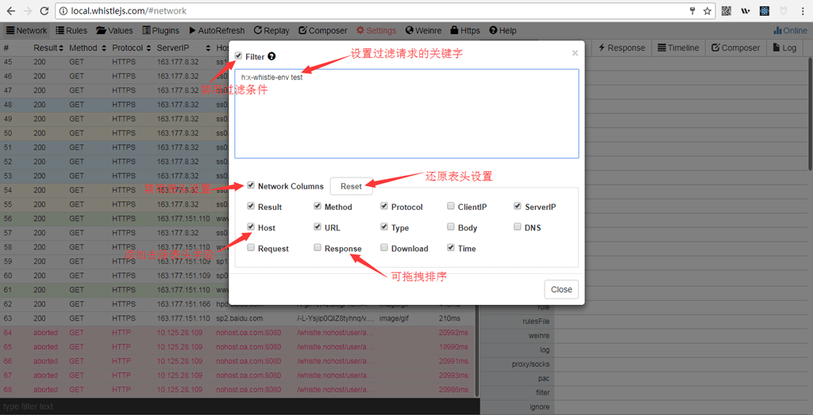

# Settings

在 whistle 的界面中，分别有 **Network**、**Rules**、**Values** 三个页面有 **Settings** 菜单，其中，**Rules** 和 **Values** 的 **Settings** 主要用于设置编辑器样式及是否允许多选 Rules，具体分别参见：[Rules 界面说明](webui/rules.md) 和 [Values 界面说明](webui/values.md)。

#### Network

1. Filter：用来设置过滤请求的关键字，Networt 的 Settings 按钮上的 Filter 和请求列表下方的 Filter 的区别是，前者会把不匹配的请求直接过滤掉，无法再找回来，而后后者只是把列表中的 Dom 节点隐藏了，且 Settings 按钮上的 Filter 功能更强大，可以同时匹配 url、请求响应头、请求方法、响应状态码、ClientIP 及 ServerIP、请求响应内容 (以上匹配都不区分大小写)。

	Filter:

		test1 test2 test2
		key1 key2 key3
		h:head1 heade2 head3
		h: h1 h2
		s: 200
		i: 100 88
		i: 11 77
		m: get
		b: keyword1 keyword2
		b: keyword3

	`h:`、`s:`、`i:`、`m:`、`b:` 分别表示匹配请求响应头、请求方法、响应状态码、ClientIP 及 ServerIP、请求响应内容、其它表示匹配 url(以上匹配都不区分大小写)，同一行内容多个匹配用空格隔开，最多支持 3 个，表示对应的内容要同时匹配这三个关键字，不同行表示或的关系。
  
	**也支持取反操作，即 `!host1` 、 `m:!host1` 会保留请求url中不包含host1的请求。**

2. Network Columns：主要用于设置 Network 表头，或者拖拽重排等

